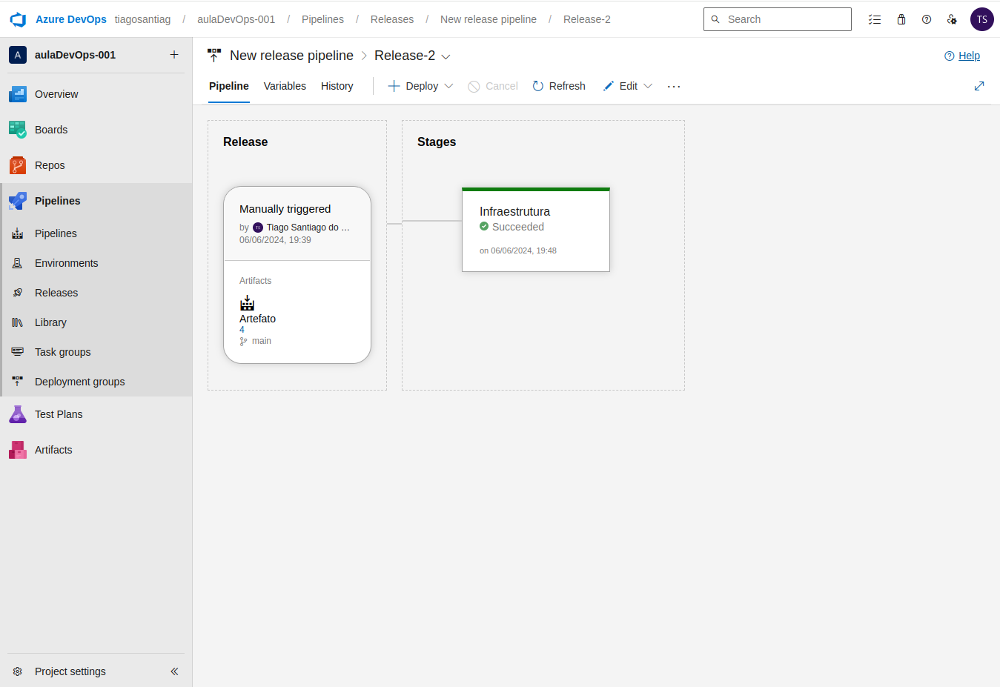

<h1>
    <a href="https://www.dio.me/">
     </a>
    <span>Formação DevOps Fundamentals</span>
</h1>

# :computer: Desafio: Entendendo na Prática a Cultura DevOps com Azure DevOps

Nesse desafio criamos infraestrutura na Azure utilizando o terraform e o Azure DevOps.

Repositório do instrutor: 

 https://github.com/alexsandrolechner/auladevopsfundamentals

# :bulb: Solução do desafio

## Criando os recursos localmente

### No Azure:

- Após criação da conta na azure foi feito o registro de aplicativo


- Então a chave foi adicionada em certificados e segredos:

 
 
- O valor foi copiado e guardado pois não fica disponível posteriormente.

### No computador local:

- Seguindo a documentação, instalei o terraform e azure-cli

- Loguei no azure com 

```console
$ az login
az account set --subscription "subscription-id"
```

- Atualizei as variáveis:

 ```console
$ export ARM_CLIENT_ID="<APPID_VALUE>"
$ export ARM_CLIENT_SECRET="<PASSWORD_VALUE>"
$ export ARM_SUBSCRIPTION_ID="<SUBSCRIPTION_ID>"
$ export ARM_TENANT_ID="<TENANT_VALUE>"
 ```

 SUBSCRIPTION_ID e TENANT_VALUE são os valores da inscrição vistos após executar ```$ az login```

<APPID_VALUE> é o Id secreto na chave criada e
<PASSWORD_VALUE> Valor guardado após criação da chave.

- Na pasta <b>codigoTerraform</b> do repositório git clonado do instrutor, modifiquei o arquivo <b>site.tf</b> para criar o Resource Group e conta de armazenamento com local no Brasil. No arquivo <b>variables.tf</b> modifiquei para incluir somente a tag Area: Infraestrutura. Então executei os comandos: 

```console
$ terraform init
$ terraform plan
$ terraform apply
```

Podemos ver que a conta de armazenamento 


e o grupo de recurso com a tag correta foram criados


## Criando os recursos com o Azure DevOps

### No Azure:

- Em assinaturas, controle de acesso, adicionei a função de contributor para o aplicativo.

- Dentro da conta de armazenamento criei um container para poder criar a pipeline do terraform com o Azure devOps.

### No Azure DevOps:

- Após criar a conta no Azure devOps, em configurações da organização, configurações de pipeline, habilitei o editor clássico.

- Criei um projeto e, dentro do projeto, um repositório vazio o qual será utilizado ao criar a pipeline.

- Conectei com a conta Azure e criei uma pipeline com o editor clássico. Adicionei o terraform para executar o comando init.

- Como descrito nas aulas, deu erro devido de parallel jobs.


Preenchi o formulário para a liberação do parallel job gratuito.

- Após o recurso liberado, subi os arquivos <b>site.tf</b> e <b>variables.tf</b> modificando o nome do resource group para "rg-auladevops-002" e a storage account "staccdevopsrgaula2" para que não haja conflito de nome quando forem criados os recursos.

- A pipeline foi executada


- E rodou corretamente


- Então criei o release, colocando a parte de planejamento e criação dentro de Infraestrutura



- O Deploy foi bem sucedido. 


- Podemos ver o novo resource group na azure.


